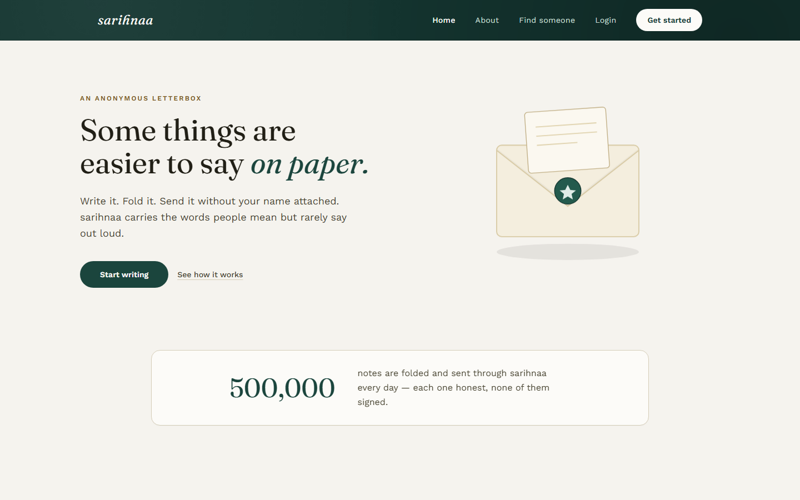
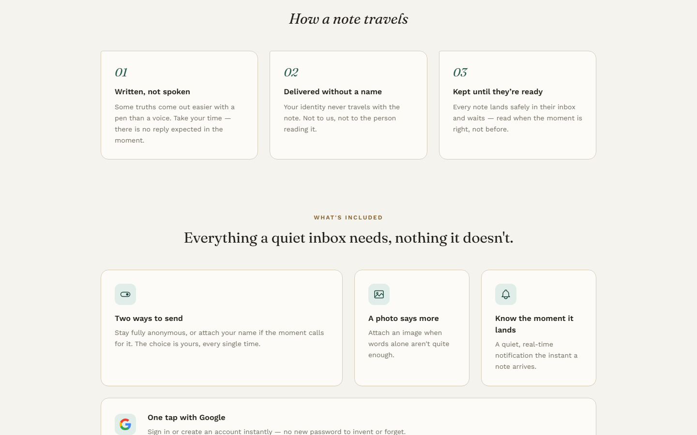
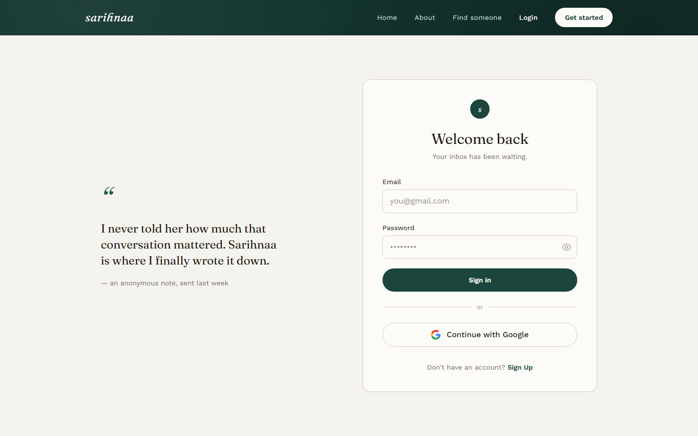
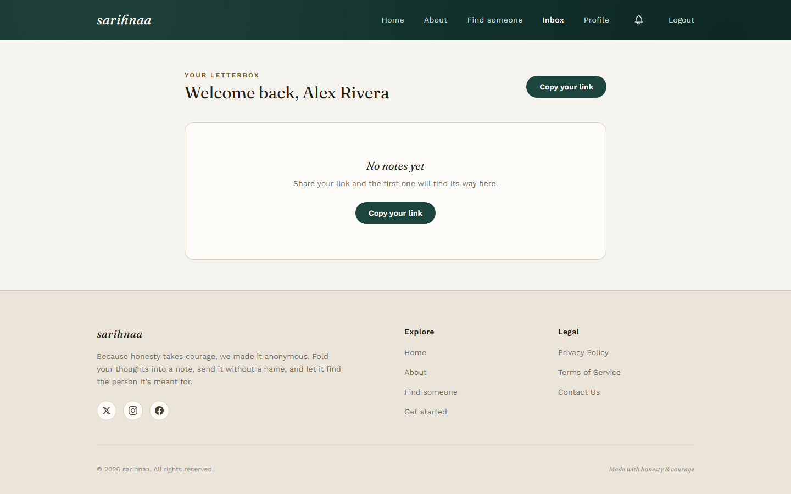

# sarihnaa — صراحنى

> Because honesty takes courage, we made it anonymous.

sarihnaa is a full-stack anonymous messaging app. Every user gets a private link; anyone who
has it can send them an honest note — signed or unsigned — and read it back safely, with
real-time notifications when a new one arrives.

<p align="center">
  
</p>
<p align="center">
  
</p>

<table>
  <tr>
    <td></td>
    <td></td>
  </tr>
</table>

## Tech stack

**Backend** — `src/`

| | |
|---|---|
| Runtime | Node.js (ESM), Express 5 |
| Database | MongoDB via Mongoose |
| Cache / sessions | Redis (OTP codes, refresh-token store, token blacklist) |
| Auth | JWT access + refresh tokens, HttpOnly refresh cookie, Passport (Google OAuth 2.0), Google Identity Services (One Tap) |
| Real-time | Socket.IO |
| Validation | Joi |
| Uploads | Multer + `file-type` (magic-number MIME sniffing, not just file extension) |
| Security | Helmet, CORS allow-list, `cookie-parser`, `express-rate-limit`, bcrypt password hashing, AES-256 phone-number encryption at rest |
| Email | Nodemailer |

**Frontend** — `frontend/`

| | |
|---|---|
| Framework | React 19 + Vite |
| Routing | React Router 7 |
| Styling | Tailwind CSS 4 (custom design-token theme) |
| HTTP | Axios |
| Validation | Zod |
| Real-time | socket.io-client |
| Auth UI | Google Identity Services (One Tap) alongside the classic OAuth redirect |

## Security highlights

This project went through a dedicated hardening pass — worth calling out explicitly:

- **Tokens are never persisted client-side.** The refresh token lives only in an `HttpOnly`,
  `Secure`, `SameSite` cookie the browser can't read; the access token lives only in memory
  (an in-memory store, not `localStorage`) and is re-derived from the cookie on every page load.
- **CSRF double-submit cookie** on the one endpoint that's authenticated purely by cookie
  (`/auth/refresh-token`).
- **Content-Security-Policy**, `X-Frame-Options: DENY`, and related headers on the served frontend.
- **Every file upload** is checked by its actual binary signature, not its filename/extension.
- **Client-side validation (Zod)** mirrors the backend's Joi rules for fast feedback, but the
  backend remains the source of truth.
- Rate limiting, bcrypt-hashed passwords, and encrypted phone numbers at rest.

## Features

- Email/password sign-up with OTP email verification, or Google sign-in/sign-up in one click
  (redirect flow and One Tap both wired up)
- Anonymous messaging to any user via their public link — no account needed to send
- Optional "send with my name" mode for signed-in senders
- Real-time inbox notifications over WebSocket
- Image attachments on messages
- Profile page with avatar upload and a shareable public link
- Logout, and logout from all devices (revokes every outstanding session)

## Project structure

```
├── src/                    # Express backend
│   ├── modules/            # auth / user / message — controller + service per module
│   ├── middleware/         # auth, validation, rate limiting, file validation
│   ├── db/                 # Mongo connection, Redis connection, repositories, Socket.IO
│   └── common/              # shared utils (jwt, bcrypt, encryption, mailer, error types)
├── config/                 # env loading (see config/.env.example)
├── frontend/                # React + Vite SPA
│   └── src/
│       ├── pages/           # one file per route
│       ├── components/      # Header, Footer, shared UI
│       ├── context/         # Auth + Notification providers
│       ├── api/             # axios client + per-resource API calls
│       └── validation/      # Zod schemas
└── uploads/                 # runtime file storage (gitignored)
```

## Getting started

### Prerequisites

- Node.js 20+
- MongoDB running locally (or a connection string)
- Redis instance (the project defaults to a hosted Upstash URL — swap in your own)
- A Google Cloud OAuth Client ID/Secret if you want Google sign-in locally

### Backend

```bash
npm install
cp config/.env.example config/.env.dev   # fill in your own values
npm run dev
```

The API runs on `http://localhost:3000`.

### Frontend

```bash
cd frontend
npm install
cp .env.example .env                      # defaults already point at localhost:3000
npm run dev
```

The app runs on `http://localhost:5173`.

> Both `.env.example` files document every variable that's needed — see
> `config/.env.example` and `frontend/.env.example`. Never commit a real `.env` / `.env.dev`;
> both are gitignored.

## API overview

| Method | Route | Description |
|---|---|---|
| POST | `/auth/sign-up` | Create an account (pending email verification) |
| POST | `/auth/verifyEmail` | Verify the OTP sent by email |
| POST | `/auth/re-send-otp` | Resend the OTP (rate-limited) |
| POST | `/auth/login` | Email/password login |
| GET | `/auth/refresh-token` | Rotate the access token from the refresh cookie (CSRF-protected) |
| GET | `/auth/google` / `/auth/google/callback` | Google OAuth redirect flow |
| POST | `/auth/sign-with-google` | Google Identity Services (One Tap) flow |
| GET | `/user/` | List users (for the "find someone" picker) |
| GET | `/user/profile` | Current user's profile |
| PATCH | `/user/upload-pic-profile` | Upload/replace avatar |
| PATCH | `/user/log-out-from-all-devecis` | Revoke every session |
| POST | `/user/black-list` | Logout (revoke current session) |
| GET / POST / DELETE | `/messages/*` | List, fetch, send (anonymous or signed), delete messages |

## License

ISC
